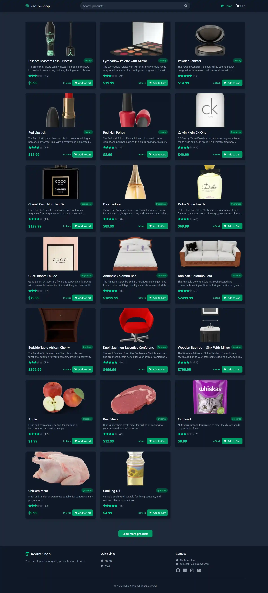
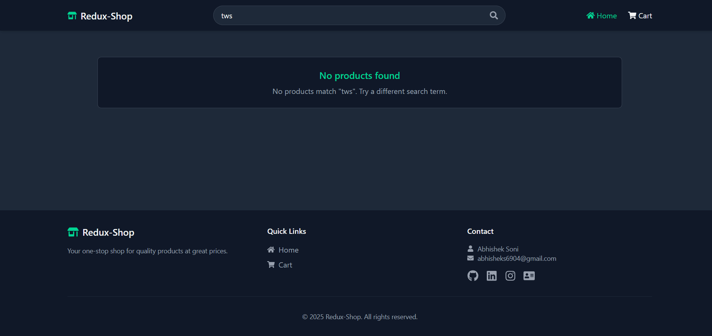
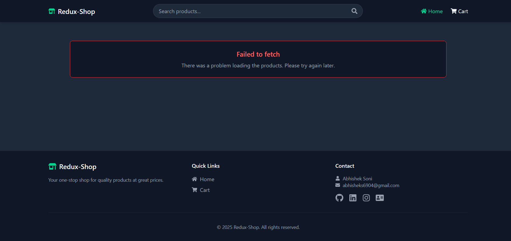
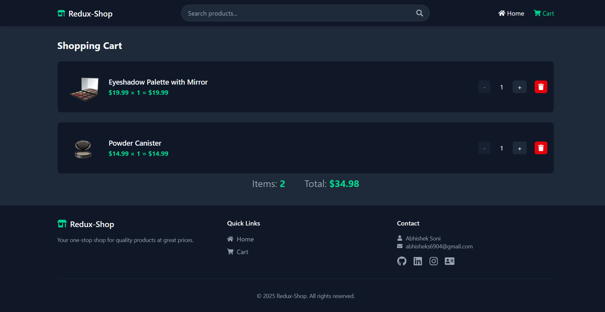
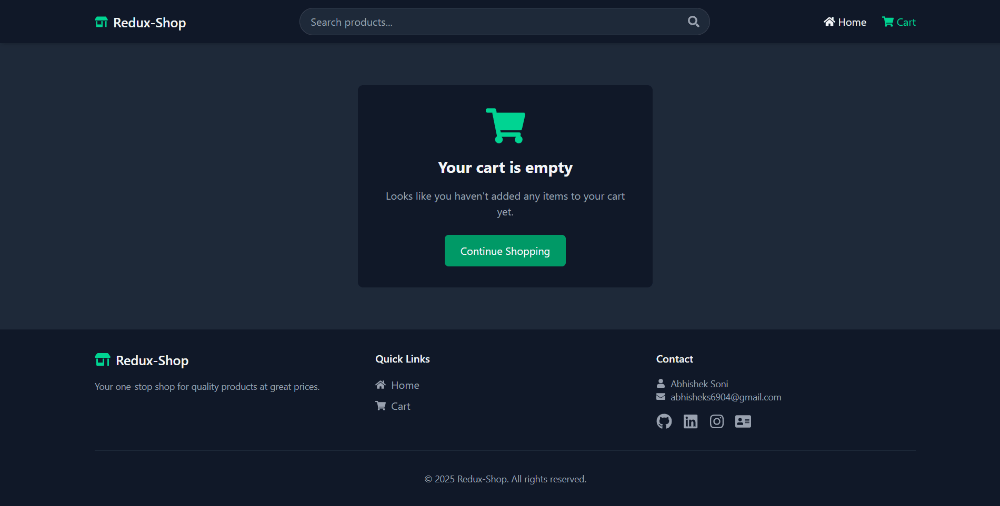

# Redux Shop 🛒

A modern e-commerce app built with **React**, **Redux Toolkit**, **React Router DOM**, and **Tailwind CSS**.  
Browse products, search, add to cart, and enjoy a smooth shopping experience!

---

## 🚀 Live Demo

[https://abhishek-soni6904.github.io/redux-cart-app/](https://abhishek-soni6904.github.io/redux-cart-app/)

---

## ✨ Features

- Product listing with images, categories, and ratings
- Powerful search functionality
- Add/remove products to/from cart
- Update product quantities in cart
- Persistent cart (localStorage)
- Responsive design with Tailwind CSS
- Toast notifications for user actions
- Social and contact links in the footer

---

## 🛠️ Tech Stack

- [React](https://react.dev/)
- [Redux Toolkit](https://redux-toolkit.js.org/)
- [React Router DOM](https://reactrouter.com/)
- [Tailwind CSS](https://tailwindcss.com/)
- [Vite](https://vitejs.dev/)
- [React Icons](https://react-icons.github.io/react-icons/)
- [React Toastify](https://fkhadra.github.io/react-toastify/)

---

## 📦 Installation

1. **Clone the repository:**

   ```sh
   git clone https://github.com/your-username/redux-cart-app.git
   cd redux-cart-app
   ```

2. **Install dependencies:**

   ```sh
   npm install
   ```

3. **Start the development server:**

   ```sh
   npm run dev
   ```

4. Open [http://localhost:5173](http://localhost:5173) in your browser.

---

## 📸 Screenshots

| Home                          | No Results                                | Failed to Fetch Products                            |
| ----------------------------- | ----------------------------------------- | --------------------------------------------------- |
|  |  |  |

| Cart                          | Empty Cart                                |
| ----------------------------- | ----------------------------------------- |
|  |  |

---

## 📄 License

This project is licensed under the [MIT License](LICENSE).

---

## Contact📩  
For any queries or support, feel free to reach out:
- **👤 Name**: Abhishek Soni
- **📧 Email**: abhisheks6904@gmail.com
- **🔗 GitHub**: [Abhishek-soni6904](https://github.com/Abhishek-soni6904)
- **📸 Instagram**: [\_abhishek.\_\.soni\_](https://www.instagram.com/_abhishek._.soni_/)
- **💼 LinkedIn**: [Abhishek Soni](https://www.linkedin.com/in/abhishek-soni-662028331/)